## 1 最大化控制资源成本

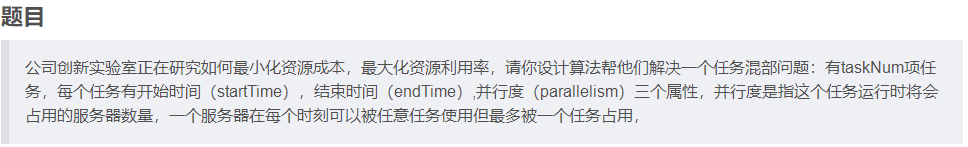

## 2 完美走位

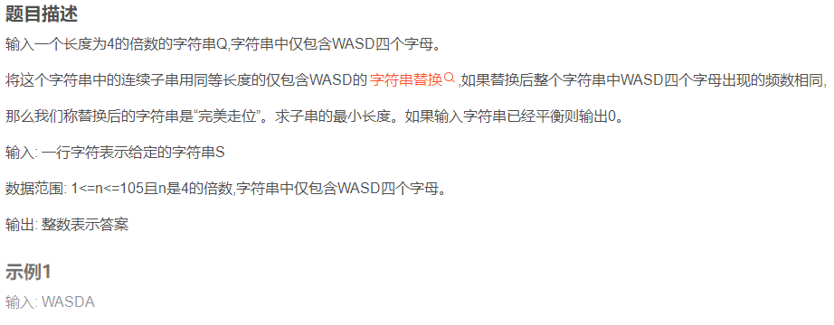

## 3 羊、狼、农夫过河

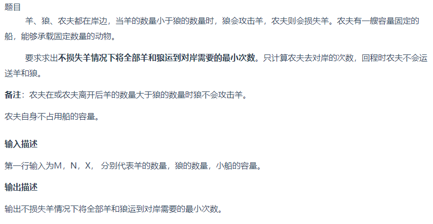

## 4 字符串重新排列

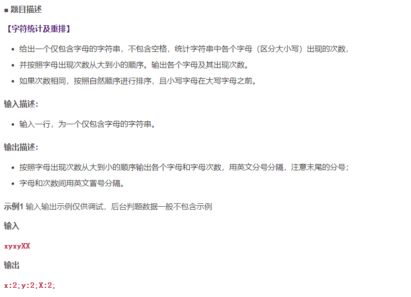

```cpp
#include <bits/stdc++.h>
 
using namespace std;
 
class Solution {
public:
    string CharacterStatistics(string &s)
    {
        vector<int>array(256,0);
        for (char i : s) {
            array[(int)i]++;
        }
        int maxx = *max_element(array.begin(), array.end());
        string StringBuilder;
        for (int i = maxx; i > 0; i --) {
            for (int j = 97; j < 123; j ++) {
                if (array[j] == i) {
                    StringBuilder.push_back((char)j);
                    StringBuilder.append(":");
                    StringBuilder.append(to_string(i));
                    StringBuilder.append(";");
                }
            }
            for (int j = 65; j < 91; j ++) {
                if (array[j] == i) {
                    StringBuilder.push_back((char)j);
                    StringBuilder.append(":");
                    StringBuilder.append(to_string(i));
                    StringBuilder.append(";");
                }
            }
        }
        return StringBuilder;
    }
};
 
int main(int argc, const char *argv[])
{
    string str;
    getline(cin, str);
    Solution solo;
    cout << solo.CharacterStatistics(str) << endl;
    return 0;
}
```

## 5 租车骑绿岛

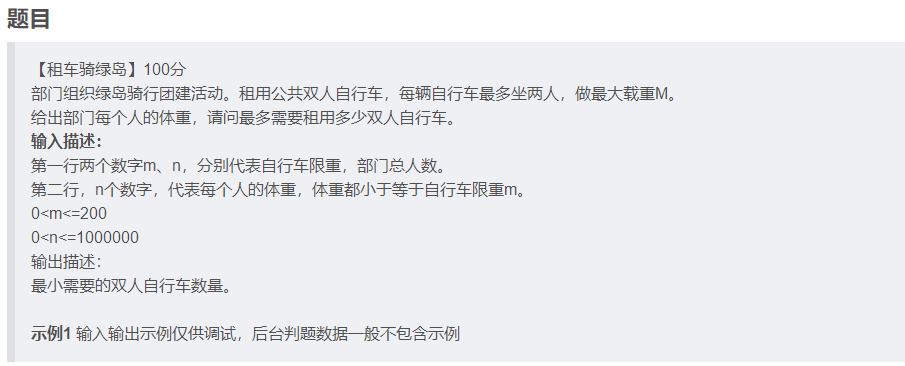

## 6 无向图染色

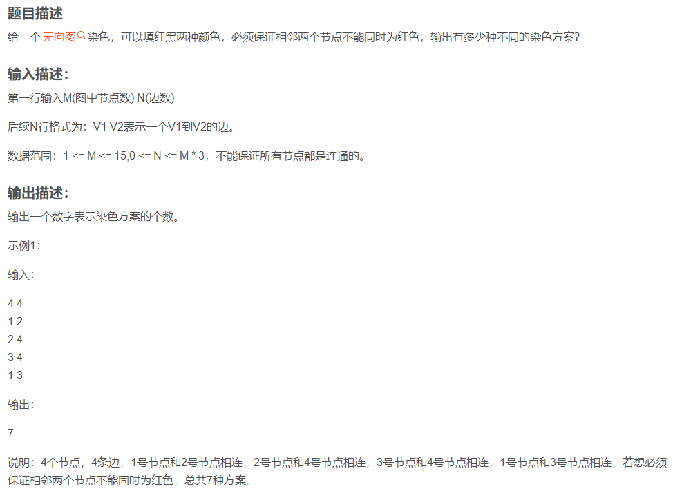

### 解法一：通用方案，DFS

```cpp
#include <iostream>
#include <vector>
#include <algorithm>

using namespace std;

int M, N;
int ans = 0;
void dfs(int index, vector<vector<int>>& vec, vector<int> &vecColor);
int main()
{
	int tmp1 = 0, tmp2 = 0;
	cin >> M >> N;
	vector<vector<int>>vec(M, vector<int>(M, 0));

	vector<int>vecColor(M, 0);
	for (int i = 0; i < N; ++i)
	{
		cin >> tmp1 >> tmp2;
		vec[tmp1 - 1][tmp2 - 1] = 1;
		vec[tmp2 - 1][tmp1 - 1] = 1;
	}

	dfs(0, vec, vecColor);

	cout << ans << endl;

	return 0;
}
//判断当前节点是否有联通的红色节点
bool isRed(int index, vector<vector<int>>& vec, vector<int> &vecColor)
{
	for (int i = 0; i < M; ++i)
	{
		if (vec[index][i] == 1 /*&& vecFlag[i] == false*/ && vecColor[i] == 1)
		{
			return true;
		}
	}
	return false;
}
void dfs(int index, vector<vector<int>>& vec, vector<int> &vecColor)
{
	if (index == M)
	{
		ans++;
		return;
	}
	//bool flagRed = isRed(index, vec, vecColor);

	if (!isRed(index, vec, vecColor))//判断当前节点是否有联通的红色节点
	{
		//无，当前节点可置为红色或黑色
		vecColor[index] = 1;
		dfs(index + 1, vec, vecColor);
		vecColor[index] = 0;
		dfs(index + 1, vec, vecColor);
	}
	else
	{
		//有，当前节点只可置默认的黑色
		dfs(index + 1, vec, vecColor);
	}
}
```

### 解法二：特殊方案

```
1：数据范围比较小，因此可以考虑暴力破解的方式。
2：图类似的题目，基本就是考察节点和边的处理方式。
节点的表达方式：int -> 二进制数字。举例：1 1000101，1表示红色，0表示黑色
边的表达方式：pair<int, int> 表示两个节点之间相连，存到数组中。
3：有了节点和边，直接遍历所有的可能表达方式即可
```

```cpp
#include<iostream>
#include<vector>
#include<stdlib.h>
#include<algorithm>
#include<string.h>
#include<exception> 
#include<map>
#include<cmath>
#include<unordered_map>
#include<set>
#include<climits>
#include<ctype.h>
#include<queue>
#include<stack>
#include<list>
using namespace std;

int main() {
    //处理输入
    int m, n;
    cin >> m >> n;
    vector<pair<int, int>> edges;
    for (int i = 0; i < n; i++) {
        int a, b;
        cin >> a >> b;
        edges.push_back(make_pair(a, b));
    }

    int count = 0;
    //遍历所有可能的组合 10001 -> i 的二进制表达
    for (int i = 0; i < (1 << m); i++) {
        bool flag = 1;
        // 检测所有的边相连的是否同为红颜色
        for (auto edge : edges) {
            if (((i >> (m-edge.first)) & 1) && ((i >> (m-edge.second)) & 1)) {
                flag = false;
                break;
            }
        }
        if(flag) {
            count++;
        }
    }
    cout << count;
    return 0;
}
```

## 7 单向链表中间节点

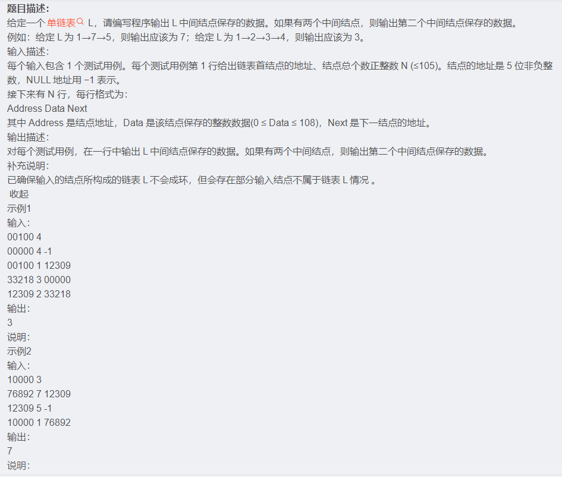

## 8 等和子数组最小和

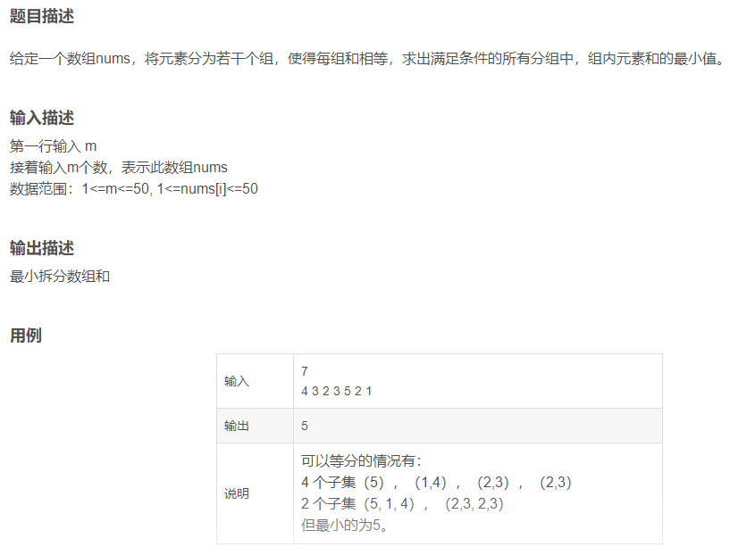

## 9 最多颜色的车辆

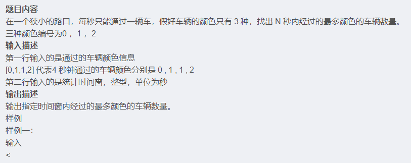

## 10 不含 101 的数

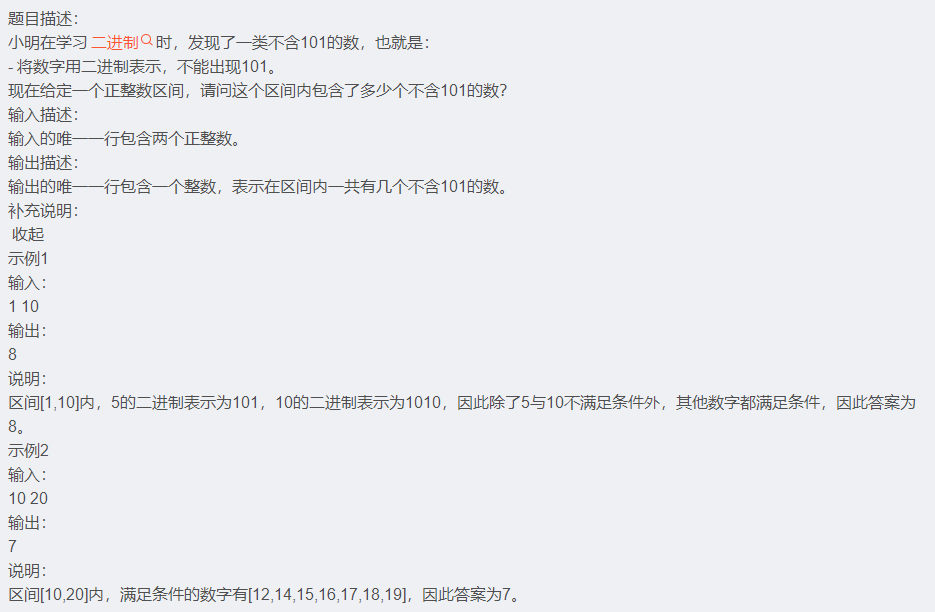

## 11 过滤组合字符串

**题目描述：**

数字0、1、2、3、4、5、6、7、8、9分别关联 a~z 26个英文字母。

0 关联 "a","b","c"

1 关联 "d","e","f"

2 关联 "g","h","i"

3 关联 "j","k","l"

4 关联 "m","n","o"

5 关联 "p","q","r"

6 关联 "s","t"

7 关联 "u","v"

8 关联 "w","x"

9 关联 "y","z"

例如7关联"u","v"，8关联"x","w"，输入一个字符串例如“78”，和一个屏蔽字符串“ux”,那么“78”可以组成多个字符串例如：“ux”，“uw”，“vx”，“vw”，过滤这些完全包含屏蔽字符串的每一个字符的字符串，然后输出剩下的字符串。

**示例：**

**输入：**

78

ux

**输出：**

uw vx vw

说明：ux完全包含屏蔽字符串ux，因此剔除

## 12 真正的密码

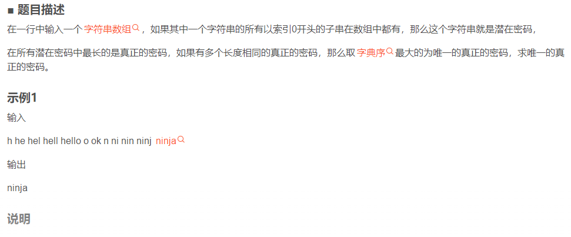

## 13 最小调整顺序次数

> 给定一个队列，但是这个队列比较特殊，可以从头部添加数据，也可以从尾部添加数据，但是只能从头部删除数据。输入一个数字n，会依次添加数字1~n（也就是添加n次）。
>
> 但是在添加数据的过程中，也会删除数据，要求删除必须按照1~n按照顺序进行删除，所以在删除时，可以根据需要调整队列中数字的顺序以满足删除条件。
> 输入描述：
>
> 第一行一个数据N，表示数据的范围。
>
> 接下来的2N行是添加和删除语句。其中：head add x 表示从头部添加元素 x，tail add
> 表示从尾部添加元素，remove表示删除元素。
>
> 输出描述：
>
> 输出一个数字，表示最小的调整顺序次数。
>
> 示例：
>
> 5
> head add 1
> tail add 2
> remove
> head add 3
> tail add 4
> head add 5
> remove
> remove
> remove
> remove
>
> 输出：
>
> 1
>
> 说明：
>
> 第1步：[1]
>
> 第2步：[1,2]
>
> 第3步：头部删除1，无需调整，还剩[2]
>
> 第4步：[3,2]
>
> 第5步：[3,2,4]
>
> 第6步：[5,3,2,4]
>
> 第7步：头部删除2，调整顺序再删除，还剩[3，4，5]
>
> 第8步：头部删除3，无需调整，还剩[4，5]
>
> 第9步：头部删除4，无需调整，还剩[5]
>
> 第10步：头部删除5，无需调整
>
> 只需要调整1次

```cpp
#include <iostream>
#include <string>
#include <map>
#include <set>
#include <vector>
#include <algorithm>
#include <numeric>

using namespace std;

int main()
{
	int n = 0;
	string operat;

	cin >> n;
	getchar();
	bool isOrder = true;
	int ans = 0;
	int size = 0;
	for (int i = 0; i < 2 * n; ++i)
	{
		getline(cin, operat);
		if (operat.find("remove") != string::npos)
		{
			if (isOrder == false)
			{
				isOrder = true;
				ans++;
			}
		}
		else if (operat.find("head add") != string::npos)
		{
			int pos = operat.rfind(" ");
			int data = stoi(operat.substr(pos + 1));
			if (size)
			{
				isOrder = false;
			}
			size++;
		}
		else if (operat.find("tail add") != string::npos)
		{
			int pos = operat.rfind(" ");
			int data = stoi(operat.substr(pos + 1));
			size++;
		}
	}

	cout << ans << endl;
	return 0;
}
```

## 14 探索地块建立

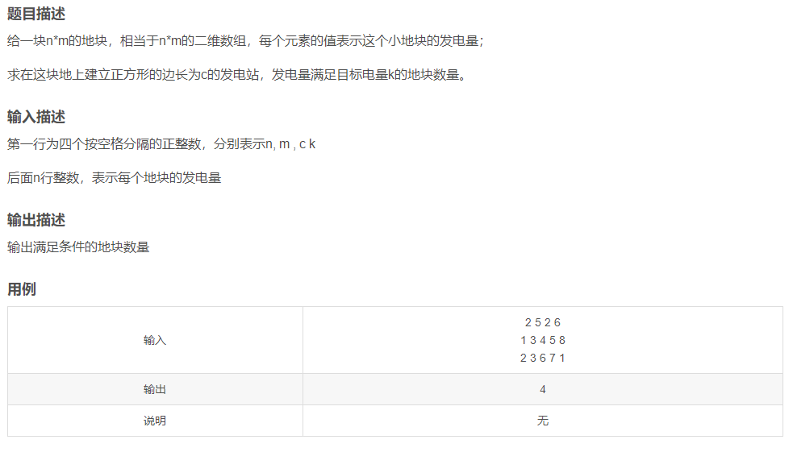

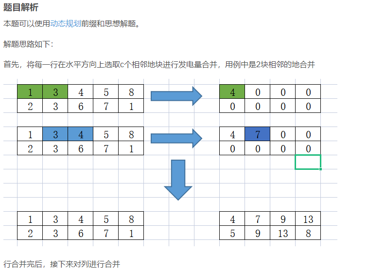

## 15 模拟商场优惠打折

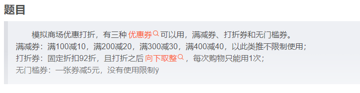

## 16 区间交叠问题

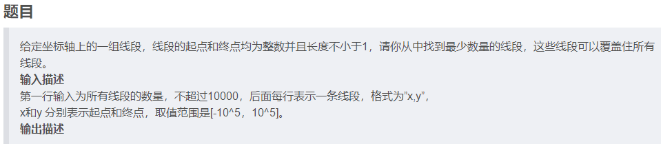

## 17 二元组个数

给定两个数组a，b，若a[i] == b[j] 则称 [i, j] 为一个二元组，求在给定的两个数组中，二元组的个数。

输入描述：

第一行输入 m

第二行输入m个数，表示第一个数组

第三行输入 n

第四行输入n个数，表示第二个数组

输出描述：

二元组个数。

示例1：

输入：

4

1 2 3 4

1

1

输出：

1

说明：二元组个数为 1个

示例2：

输入：

4

1 1 2 2

3

2 2 4

输出：

4

说明：二元组个数为 4 个 

## 18 最大平分数组

给定一个数组nums，可以将元素分为若干个组，使得每组和相等，求出满足条件的所有分组中，最大的平分组个数。

**输入描述：**

第一行输入 m

接着输入m个数，表示此数组

数据范围:1<=M<=50, 1<=nums[i]<=50

**输出描述：**

最大的平分组数个数。

**示例1：**

输入：

7

4 3 2 3 5 2 1

输出：

4

说明：可以等分的情况有：

4 个子集（5），（1,4），（2,3），（2,3）

2 个子集（5, 1, 4），（2,3, 2,3）

最大的平分组数个数为4个。

**示例2：**

输入：

7

5 2 1 5 2 1 5 2 1

输出：

4

说明：可以等分的情况有：

4 个子集（5，1），（5，1），（5，1），（2，2，2）

2 个子集（5, 1, 5,1），（2,2, 2,5,1）

最大的平分组数个数为4个。


