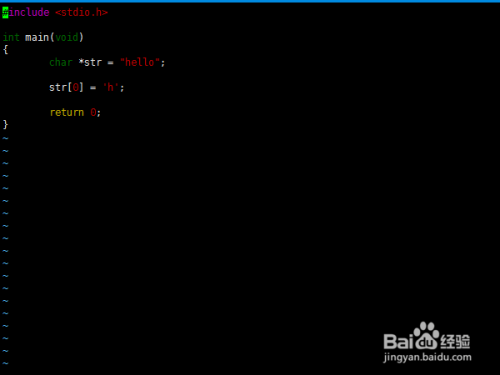
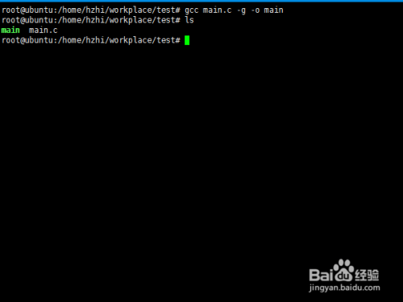
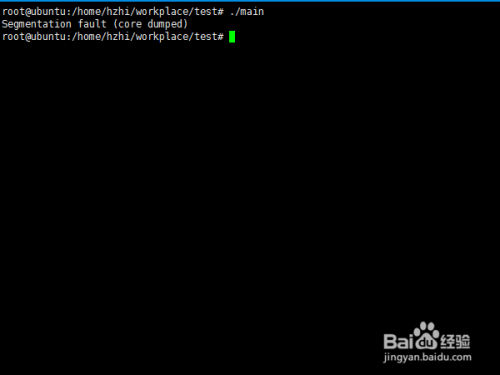
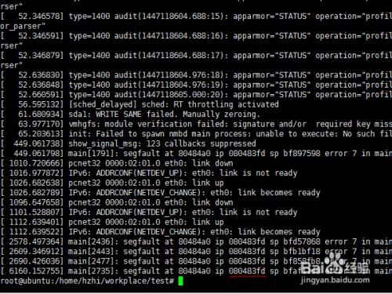
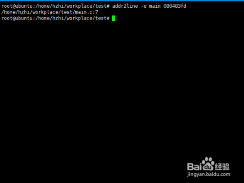
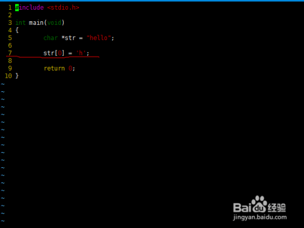

https://blog.csdn.net/jinking01/article/details/126564672

https://blog.csdn.net/u013827488/article/details/107048407/

https://blog.csdn.net/fengbingchun/article/details/119980076

# linux调试----addr2line使用播报文章

我们在linux下开发程序时，经常遇到Segmentation fault的错误信息，如果代码比较少还可以去一行行排除，但是代码量比较大的时候，往往是一件头疼的事情。Segmentation fault会有地址抛出，我们可以利用addr2line定位到程序出错的行，这样是不是很方便的排查问题。下面就简单的介绍一下addr2line的使用方法。

## 工具/原料

- linux
- gcc，addr2line

## 方法/步骤

1. 

   编写测试代码故意产生Segmentation fault。

   

2. 

   gcc编译测试代码，注意需要增加-g选项

   

3. 

   运行测试代码，产生Segmentation fault信息

   

4. 

   dmesg查看系统崩溃的信息，查找崩溃的地址

   

5. 

   使用addr2line命令查看错误信息

   

6. 

   打开测试代码，定位到错误的信息，后续就可以修改错误的代码了

   

   END

经验内容仅供参考，如果您需解决具体问题(尤其法律、医学等领域)，建议您详细咨询相关领域专业人士。

*作者声明：*本篇经验系本人依照真实经历原创，未经许可，谢绝转载。

###  