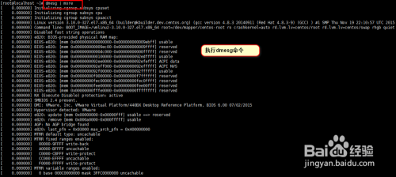
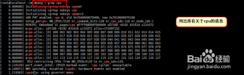
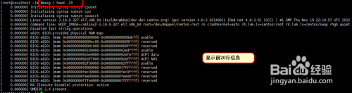
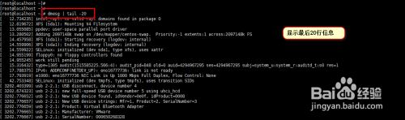
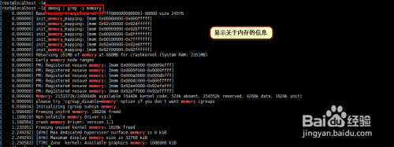
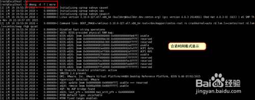

https://blog.csdn.net/daocaokafei/article/details/114545704

# Linux内核信息dmesg命令详解播报文章

dmesg命令显示linux内核的环形缓冲区信息，我们可以从中获得诸如系统架构、cpu、挂载的硬件，RAM等多个运行级别的大量的系统信息。当计算机启动时，系统内核（操作系统的核心部分）将会被加载到内存中。在加载的过程中会显示很多的信息，在这些信息中我们可以看到内核检测硬件设备。本篇我们以centos7为例进行操作。

## 工具/原料

- centos7操作系统

## 方法/步骤

1. 

   首先介绍一个命令，列出加载到内核中的所有驱动信息。我们可以使用more命令配合使用。输入命令"dmesg | more",具体操作方式如下图所示。

   

2. 

   假如我们只想查看关于CPU的信息，我们可以输入命令"dmesg | grep cpu",具体展示如下图所示。

   

3. 

   下面介绍另外一种用法，我们只输出dmesg命令的前20行日志。具体命令为"dmesg | head -20",具体操作如下图所示。

   

4. 

   我们也可以只输出dmesg的最后20行日志，具体命令为"dmesg | tail -20",具体操作如下图所示。

   

5. 

   由于‘dmesg’命令的输出实在太长了，在其中搜索某个特定的字符串是非常困难的。因此，有必要过滤出一些包含‘usb’ ‘dma’ ‘tty’ ‘memory’等字符串的日志行。grep 命令 的‘-i’选项表示忽略大小写。下面我们就介绍只查看关于memory的信息。具体命令格式为"dmesg | grep -i memory".具体如下图所示。

   

6. 

   当然我们也可以实时监控dmesg日志的输出信息。命令格式为"watch "dmesg | tail -20" "。

7. 

   清除缓冲区日志的命令为"dmesg -c"。

8. 

   当然我们也可以选择合适的时间格式显示信息。具体命令格式为"dmesg -d -T | more",具体操作如下图所示。

   

   END

经验内容仅供参考，如果您需解决具体问题(尤其法律、医学等领域)，建议您详细咨询相关领域专业人士。