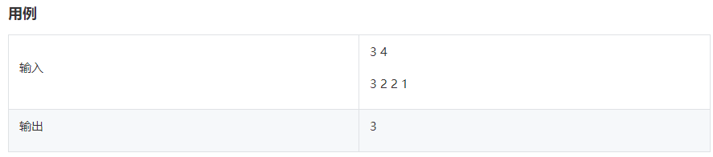

## 1 最大化控制资源成本


公司创新实验室正在研究如何最小化资源成本，最大化资源利用率，请你设计算法帮他们解决一个任务混部问题：有taskNum项任务，每个任务有开始时间（startTime），结束时间（endTime）,并行度（parallelism）三个属性，并行度是指这个任务运行时将会占用的服务器数量，一个服务器在每个时刻可以被任意任务使用但最多被一个任务占用，任务运行完成立即释放（结束时刻不占用）。任务混部问题是指给定一批任务，让这批任务由同一批服务器承载运行，请你计算完成这批任务混部最少需要多少服务器，从而最大最大化控制资源成本。

**输入描述：**

第一行输入为taskNum，表示有taskNum项任务

接下来taskNum行，每行三个整数，表示每个任务的开始时间

（startTime ），结束时间（endTime ），并行度（parallelism）

**输出描述：**

一个整数，表示最少需要的服务器数量

**示例1** 输入输出示例仅供调试，后台判断数据一般不包含示例

输入

3

2 3 1

6 9 2

0 5 1

输出

2

**说明**

一共有三个任务，第一个任务在时间区间【2，3】运行，占用1个服务

器，第二个任务在时间区间【6，9】运行，占用2个服务器，第三个任

务在时间区间【0，5】运行，占用1个服务器，需要最多服务器的时间

区间为【2，3】和【6，9】，需要2个服务器。

**示例2** 输入输出示例仅供调试，后台判断数据一般不包含示例

输入

2

3 9 2

4 7 3

输出

5

**说明**

一共两个任务，第一个任务在时间区间【3，9】运行，占用2个服务

器，第二个任务在时间区间【4，7】运行，占用3个服务器，需要最多

服务器的时间区间为【4，7】，需要5个服务器。

**备注：**

1<=taskNum<=100000

0<=startTime<endTime<=50000

1<=parallelism<=100

```cpp
import java.util.Scanner;
import java.util.*;
import java.util.stream.Collectors;
 
public class Main { 
    public static int max_machine;
 
    public static void main(String[] args) { 
        //处理输入
        Scanner in=new Scanner(System.in); 
        int taskNum = in.nextInt(); 
 
        //构造输入数据结构
        ArrayList<ArrayList<Integer>> outerArrayList = new ArrayList<ArrayList<Integer>>();
 
        for (int i = 0; i < taskNum; i++) {
            int a = in.nextInt();
            int b = in.nextInt();
            int c = in.nextInt();
            ArrayList<Integer> innerArraylist = new ArrayList<Integer>();
            innerArraylist.add(a);
            innerArraylist.add(b);
            innerArraylist.add(c);
            outerArrayList.add(innerArraylist);
            //避免完全没有交集的特殊情况
            if (max_machine < c) {
                max_machine = c;
            }
        }
 
        //递归求交集
        while (outerArrayList.size() > 1) {
            outerArrayList = cal_public_range(outerArrayList);
        }
        System.out.println(max_machine);
    }
 
    public static ArrayList<ArrayList<Integer>> cal_public_range(ArrayList<ArrayList<Integer>> ranges) {
        //先排序 
        Comparator<ArrayList<Integer>> myComparator = new Comparator<ArrayList<Integer>>() {
            @Override
            public int compare(ArrayList<Integer> o1, ArrayList<Integer> o2) {
                if (o1.get(0)!=o2.get(0)){
                        return o1.get(0)-o2.get(0);
                    }else {
                        return o1.get(1)-o2.get(2); 
                    }
            }
        };
        Collections.sort(ranges, myComparator);
 
        //求交集
        ArrayList<ArrayList<Integer>> public_range = new ArrayList<ArrayList<Integer>> ();
        for (int i=0;i<ranges.size();i++) {
            for (int j=i+1;j<ranges.size();j++) {
                int left = Math.max(ranges.get(i).get(0), ranges.get(j).get(0));
                int right = Math.min(ranges.get(i).get(1), ranges.get(j).get(1));
                if (left <= right) {
                    ArrayList<Integer> temp = new ArrayList<Integer>();
                    temp.add(left);
                    temp.add(right);
                    temp.add(ranges.get(i).get(2)+ ranges.get(j).get(2));
                    public_range.add(temp);
                    if (ranges.get(i).get(2)+ ranges.get(j).get(2) > max_machine) {
                        max_machine = ranges.get(i).get(2)+ ranges.get(j).get(2);
                    }
                }
            }
        }
        return public_range;
    }
}
```


## 2 完美走位


> 解题思路
>  1、将字符串转成字典并统计各字符出现次数
>  2、由于题目要求输入的字符数是4的倍数,所以计算各方向需要的次数=字符串总长度/4
>  3、遍历字典，累加字典里已有方向超出各方向需要次数的次数，就是最终需要变换的次数。

```cpp
// 获得完美走位
    func HW2023011() {
        // 测试用例
//        let inputStr = "AASW"
//        let inputStr = "AAAA"
//        let inputStr = "AASAAAAA"
//        let inputStr = "ASDW"
        // 开始代码
        let inputStr = String(readLine()!)
        //  使用高阶函数将字符串转成字典并统计各字符出现次数
        let inputDic = inputStr.reduce(into: [Character: Int]()) { res, key in
            res[key] = Int(res[key] ?? 0) + 1
        }
        let needCount = inputStr.count/4 // 由于题目要求输入的字符数是4的倍数，所以计算各方向需要的次数=字符串总长度/4
        var res = 0 // 最终需要变换的次数
        for (_, v) in inputDic {
            // 累加inputDic里已有方向超出needCount的次数，就是res
            if v > needCount {
                res += (v-needCount)
            }
        }
        print(res)
    }
```


## 3 羊、狼、农夫过河


```java
import java.util.Scanner;
import java.util.*;
import java.util.stream.Collectors;
 
 
class Main {
    public static int min_times;
	public static void main(String[] args) {
        // 处理输入
        Scanner in = new Scanner(System.in);
        //转为数组
        List<Integer> nums =Arrays.stream(in.nextLine().split(" "))
                .map(Integer::parseInt)
                .collect(Collectors.toList());
        int M = nums.get(0);
        int N = nums.get(1);
        int X = nums.get(2);
 
        min_times = (M+N)*X;
    
        // 表示已运输到对岸的羊、狼个数
        int m_temp=0;
        int n_temp=0;
        
        transport(M, N, X, m_temp, n_temp, 0);
    
        if(min_times==(M+N)*X){
            System.out.println(0);
        }else{
            System.out.println(min_times);
        }
 
	}
 
    // m0, n0 分别表示剩余的羊、狼个数， x为船容量
    // m1, n1 分别表示运输到对岸的羊、狼个数，times为次数
    public static int transport(int m0, int n0, int x, int m1, int n1,int times) {
        //若可以一次性运走，结束了，注意等于号。。。
        if(x>=m0+n0){
            if(times+1<min_times){
                min_times=times+1;
            }
            return times+1;
        }
        //尝试运一部分狼一部分羊
        //要上船的羊数量不可以超过岸上数量、也不可以超过船的容量
        for(int i=0;i<=m0&&i<=x;i++){
            //要上船的狼的数量不可以超过岸上数量、也不可以超过船装了羊后的剩余的容量
            for(int j=0;j<=n0&&i+j<=x;j++){
                //不可以不运
                if(i+j==0){
                    continue;
                }
                //船离岸后，原来这岸，要么没有羊，要么羊比狼多，才可以运；对岸也要检查，不考虑回程带动物
                if((m0-i==0||m0-i>n0-j)&&(m1+i==0||m1+i>n1+j)){
                    //运一次
                    int result=transport(m0-i,n0-j,x,m1+i,n1+j,times+1);
                    //如果获取了结果，和minTime比较，但是不结束，继续检查
                    if(result<min_times&&result!=0){
                        min_times=result;
                    }
                }
            }
        }
        //没有方案了。。返回0
        return 0;
    }
}
```


## 4 字符串重新排列


```cpp
#include <bits/stdc++.h>
 
using namespace std;
 
class Solution {
public:
    string CharacterStatistics(string &s)
    {
        vector<int>array(256,0);
        for (char i : s) {
            array[(int)i]++;
        }
        int maxx = *max_element(array.begin(), array.end());
        string StringBuilder;
        for (int i = maxx; i > 0; i --) {
            for (int j = 97; j < 123; j ++) {
                if (array[j] == i) {
                    StringBuilder.push_back((char)j);
                    StringBuilder.append(":");
                    StringBuilder.append(to_string(i));
                    StringBuilder.append(";");
                }
            }
            for (int j = 65; j < 91; j ++) {
                if (array[j] == i) {
                    StringBuilder.push_back((char)j);
                    StringBuilder.append(":");
                    StringBuilder.append(to_string(i));
                    StringBuilder.append(";");
                }
            }
        }
        return StringBuilder;
    }
};
 
int main(int argc, const char *argv[])
{
    string str;
    getline(cin, str);
    Solution solo;
    cout << solo.CharacterStatistics(str) << endl;
    return 0;
}
```

## 5 租车骑绿岛




### 题目解析

本题需要最少的车辆，即尽可能组合出重量小于等于m的两人组: 尽量让体重最大和体重最小的那两个人一辆车,先把人按体重从大到小排序,如果体重最大 + 体重最小  大于 自行车载重, 就让体重大的那个人单独一辆车

利用双指针:

例如:

自行车载重: 6

索引:   0 1 2 3 4 5

体重:  6 5 4 3 2 1  

left 是  最左边那个人 ,索引 0, 体重 6

right 是 最右边那个人 , 索引 5,体重 1

一次遍历后

 自行车载重: 6

索引:   1 2 3 4 5

体重:   5 4 3 2 1  

left 是  最左边那个人 ,索引 1, 体重 5

right 是 最右边那个人 , 索引 5,体重 1


再次遍历后

 自行车载重: 6

索引:  2 3 4 

体重:  4 3 2 

left 是  最左边那个人 ,索引 2, 体重 4

right 是 最右边那个人 , 索引 4,体重 2


再次遍历后

自行车载重: 6

索引:  3

体重:  3  

此时 left = right = 3,体重为3的这个人单独一辆车

```java
import java.util.Collections;
import java.util.List;
import java.util.Scanner;
import java.util.ArrayList;

public class Main {
    public static void main(String[] args) {
        Scanner sc = new Scanner(System.in);
        String line1 = sc.nextLine();
        String[] strings = line1.split(" ");
        // 自行车载重
        Integer load = Integer.parseInt(strings[0]);
        String line2 = sc.nextLine();
        String[] people = line2.split(" ");
        // 体重列表
        List<Integer> weightList = new ArrayList<>();
        for (int i = 0; i < people.length; i++) {
            weightList.add(Integer.parseInt(people[i]));
        }
        // 将每个人按体重由大到小排序
        Collections.sort(weightList, Collections.reverseOrder());
        // 最左边的人体重,也是最大体重
        int left =0;
        // 最右边的人的体重,也是最小体重
        int right = weightList.size() -1;
        int bikeNum =0;
        while (left < right) {
            Integer maxWeight = weightList.get(left);
            Integer minWeight = weightList.get(right);
            // 最大体重 + 最小体重 <= 自行车载重
            if (minWeight + maxWeight <= load) {
                left ++;
                right --;
                bikeNum ++;
            } else {
                // 体重最大的那个人单独一辆车
                left ++;
                bikeNum ++;

            }
        }
        // 剩下最后一个人,单独一辆车
        if (left == right) {
            bikeNum++;
        }

        System.out.println(bikeNum);
    }
}
```


## 6 无向图染色


### 解法一：通用方案，DFS

```cpp
#include <iostream>
#include <vector>
#include <algorithm>

using namespace std;

int M, N;
int ans = 0;
void dfs(int index, vector<vector<int>>& vec, vector<int> &vecColor);
int main()
{
	int tmp1 = 0, tmp2 = 0;
	cin >> M >> N;
	vector<vector<int>>vec(M, vector<int>(M, 0));

	vector<int>vecColor(M, 0);
	for (int i = 0; i < N; ++i)
	{
		cin >> tmp1 >> tmp2;
		vec[tmp1 - 1][tmp2 - 1] = 1;
		vec[tmp2 - 1][tmp1 - 1] = 1;
	}

	dfs(0, vec, vecColor);

	cout << ans << endl;

	return 0;
}
//判断当前节点是否有联通的红色节点
bool isRed(int index, vector<vector<int>>& vec, vector<int> &vecColor)
{
	for (int i = 0; i < M; ++i)
	{
		if (vec[index][i] == 1 /*&& vecFlag[i] == false*/ && vecColor[i] == 1)
		{
			return true;
		}
	}
	return false;
}
void dfs(int index, vector<vector<int>>& vec, vector<int> &vecColor)
{
	if (index == M)
	{
		ans++;
		return;
	}
	//bool flagRed = isRed(index, vec, vecColor);

	if (!isRed(index, vec, vecColor))//判断当前节点是否有联通的红色节点
	{
		//无，当前节点可置为红色或黑色
		vecColor[index] = 1;
		dfs(index + 1, vec, vecColor);
		vecColor[index] = 0;
		dfs(index + 1, vec, vecColor);
	}
	else
	{
		//有，当前节点只可置默认的黑色
		dfs(index + 1, vec, vecColor);
	}
}
```

### 解法二：特殊方案

```
1：数据范围比较小，因此可以考虑暴力破解的方式。
2：图类似的题目，基本就是考察节点和边的处理方式。
节点的表达方式：int -> 二进制数字。举例：1 1000101，1表示红色，0表示黑色
边的表达方式：pair<int, int> 表示两个节点之间相连，存到数组中。
3：有了节点和边，直接遍历所有的可能表达方式即可
```

```cpp
#include<iostream>
#include<vector>
#include<stdlib.h>
#include<algorithm>
#include<string.h>
#include<exception> 
#include<map>
#include<cmath>
#include<unordered_map>
#include<set>
#include<climits>
#include<ctype.h>
#include<queue>
#include<stack>
#include<list>
using namespace std;

int main() {
    //处理输入
    int m, n;
    cin >> m >> n;
    vector<pair<int, int>> edges;
    for (int i = 0; i < n; i++) {
        int a, b;
        cin >> a >> b;
        edges.push_back(make_pair(a, b));
    }

    int count = 0;
    //遍历所有可能的组合 10001 -> i 的二进制表达
    for (int i = 0; i < (1 << m); i++) {
        bool flag = 1;
        // 检测所有的边相连的是否同为红颜色
        for (auto edge : edges) {
            if (((i >> (m-edge.first)) & 1) && ((i >> (m-edge.second)) & 1)) {
                flag = false;
                break;
            }
        }
        if(flag) {
            count++;
        }
    }
    cout << count;
    return 0;
}
```

## 7 单向链表中间节点


## 8 等和子数组最小和


## 9 最多颜色的车辆


题目描述
在一个狭小的路口，每秒只能通过一辆车，假设车辆的颜色只有 3 种，找出 N 秒内经过的最多颜色的车辆数量。

三种颜色编号为0 ，1 ，2

输入描述
第一行输入的是通过的车辆颜色信息

[0,1,1,2] 代表4 秒钟通过的车辆颜色分别是 0 , 1 , 1 , 2

第二行输入的是统计时间窗，整型，单位为秒

输出描述
输出指定时间窗内经过的最多颜色的车辆数量。

用例
输入    0 1 2 1
3
输出    2
说明    在 3 秒时间窗内，每个颜色最多出现 2 次。例如：[1,2,1]
输入    0 1 2 1
2

```python
s=input().split()
N=input()
len=len(s)
n=int(N)
def maxnum(s:int ,N:int):
    return max(s[len - N:len].count("0"),s[len - N:len].count("1"),s[len - N:len].count("2"))
print(maxnum(s,n))
```


## 10 不含 101 的数


**题目描述**

小明在学习二进制时，发现了一类不含 101的数，也就是：

将数字用二进制表示，不能出现 101 。

现在给定一个整数区间 [l,r] ，请问这个区间包含了多少个不含 101 的数？

**输入描述**

输入的唯一一行包含两个正整数 l， r（ 1 ≤ l ≤ r ≤ 10^9）。

**输出描述**

输出的唯一一行包含一个整数，表示在 [l,r] 区间内一共有几个不含 101 的数。

**示例1**

**输入：**

1 10

**输出：**

8

示例说明：

区间 [1,10] 内， 5 的二进制表示为 101 ，10的二进制表示为 1010 ，因此区间 [ 1 , 10 ] 内有 10−2=8 个不含 101的数。

**示例2**

**输入：**

10 20

**输出：**

7

示例说明：
区间 [10,20] 内，满足条件的数字有 [12,14,15,16,17,18,19] 因此答案为 7。

**题目解析**

有两个思路：

第一种是对区间中的每个数值求二进制然后判断其中是否包含101，如果不包含记数+1；

第二种是求最值的二进制，然后移动101的位置，求可能的组合个数，总数减去包含的个数就是带输出个数；

从输入的数值范围可以看出，如果使用第一种方法肯定是会超时的，感兴趣的同学可以自行实现，在评论区分享。

示例2的分析：

10对应的二进制 01010

20对应的二进制 10100

一共5位数，从最右侧开始找可能的组合 第一种字符串00101小于01010跳过；

101左移一位得到第二种字符串01010等于01010，替换第一位数和第五位数找可能，11010、11011、01011，前两个超出范围也不计算个数；（这里我们可以只考虑对101右侧的位置求组合数）

101再左移一位得到第三种字符串10100等于10100，替换第四位数和第五位数找可能，10101，10110，10111，都超出范围也不计算个数；

区间内满足条件的二进制有 01010、01011、10100，一共三个，10-3=7，输出7；

```python

def get_permutations(data=None):
    if not data:
        return ["0", "1"]

    tmp = []
    for c in data:
        tmp.append(c+"0")
        tmp.append(c+"1")
    return tmp


while 1:
    try:
        _mini, _maxi = map(int, input().split())
        _minb = bin(_mini)[2:]
        _maxb = bin(_maxi)[2:]
        lens = max(len(_minb), len(_maxb))

        sign = "101"
        # 最大值小于5的情况
        if lens < len(sign):
            print(_maxi-_mini)
            break

        set101 = set()
        permutations = None
        # 101可移动的次数
        for i in range(lens-len(sign)):
            permutations = get_permutations(permutations)
            for c in permutations:
                if int(sign+c, 2) > _maxi:
                    break
                set101.add(sign+c)

        print(_maxi-_mini-len(set101))
    except Exception as e:
        break
```


我们在根据最大值的二进制宽度，从右向左移动101的位置，求可能的组合个数，用总数减去包含101的个数就是最后需要输出的不包含101的个数了。


我们使用 get_permutations 方法来获取指定长度下 01可能的组合；

在101每移动一次后 循环比较 101和01的拼接结果是否在范围内；

当数值非常大时，会产生许多没有意义的循环操作，因为能超过范围的数只会出现在101在所有结果的两端，中间大部分的组合都是有效的数；

我们是否可以将所有的组合排序后，从两端进行剔除越界的数来解决上面的问题呢。

我们来对上一讲的代码进行优化。

```python
def get_permutations(data=None):
    if not data:
        return ["", "0", "1"]

    tmp = []
    for c in data:
        tmp.append(c+"0")
        tmp.append(c+"1")
    tmp.extend(data)
    return tmp


while 1:
    try:
        _mini, _maxi = map(int, input().split())
        _minb = bin(_mini)[2:]
        _maxb = bin(_maxi)[2:]

        sign = "101"
        # 最大值小于5的情况
        if len(_maxb) < len(sign):
            print(_maxi-_mini)
            break

        permutations = []
        # 101可移动的次数
        for i in range(len(_maxb)-len(sign)):
            permutations = set(get_permutations(permutations))

        def _zfill(x):
            return (sign+x).zfill(len(_maxb))
        # 上面产生的组合 字符串长度是不一致的
        # 如 101  1011 需要对字符串长度补齐，前面补0
        set101 = map(_zfill, permutations)
        set101 = sorted(set101)

        i = 0
        while int(set101[i], 2) < _mini:
            set101.pop(0)

        j = len(set101) - 1
        while int(set101[j], 2) > _maxi:
            set101.pop(j)
            j -= 1

        print(_maxi-_mini-len(set101))
    except Exception as e:
        break
```

## 11 过滤组合字符串

**题目描述：**

数字0、1、2、3、4、5、6、7、8、9分别关联 a~z 26个英文字母。

0 关联 "a","b","c"

1 关联 "d","e","f"

2 关联 "g","h","i"

3 关联 "j","k","l"

4 关联 "m","n","o"

5 关联 "p","q","r"

6 关联 "s","t"

7 关联 "u","v"

8 关联 "w","x"

9 关联 "y","z"

例如7关联"u","v"，8关联"x","w"，输入一个字符串例如“78”，和一个屏蔽字符串“ux”,那么“78”可以组成多个字符串例如：“ux”，“uw”，“vx”，“vw”，过滤这些完全包含屏蔽字符串的每一个字符的字符串，然后输出剩下的字符串。

**示例：**

**输入：**

78

ux

**输出：**

uw vx vw

说明：ux完全包含屏蔽字符串ux，因此剔除

```java
import java.util.Scanner;
import java.util.*;
 
 
class Main {
    public static ArrayList<String> res_str_list;
 
	public static void main(String[] args) {
        // 处理输入
        Scanner in = new Scanner(System.in);
        String num_str = in.nextLine();
        String block_str = in.nextLine();
        //预设值
        HashMap<Character, String> num_char_map = new HashMap<Character, String>();
    
        num_char_map.put('0',"abc");
        num_char_map.put('1',"def");
        num_char_map.put('2',"ghi");
        num_char_map.put('3',"jkl");
        num_char_map.put('4',"mno");
        num_char_map.put('5',"pqr");
        num_char_map.put('6',"st");
        num_char_map.put('7',"uv");
        num_char_map.put('8',"wx");
        num_char_map.put('9',"yz");
    
        res_str_list = new ArrayList<String>();
        ArrayList<Character> char_list_temp = new ArrayList<Character>();
        dfs(num_str, char_list_temp, 0, num_char_map);
 
        int result_count = res_str_list.size();
        String output_str = "";
        for (String x : res_str_list) {
            // 过滤
            if (!check(x , block_str)) {
                output_str += x + " ";
            }
        }
 
        System.out.println(output_str.substring(0, output_str.length()-1));
	}
    //判断字符是否全部包含
    public static boolean check(String string1, String string2) {
        Set<Character> set1 = new HashSet<Character>();
        for (int i=0;i<string1.length();i++) {
            set1.add(string1.charAt(i));
        }
 
        Set<Character> set2 = new HashSet<Character>();
        for (int i=0;i<string2.length();i++) {
            set2.add(string2.charAt(i));
        }
 
        for (Character single_char : set2) {  
            if (!set1.contains(single_char)){
                return false;
            }
        }
        
        return true;
 
    }
 
    // 递归求出所有可能的排列组合
    public static void dfs(String num_str, ArrayList<Character> list, int index, HashMap<Character, String> num_char_map) {
        if(index == num_str.length()) {
            String temp_str = "";
            for (int i=0;i<list.size();i++) {
                temp_str = temp_str + list.get(i);
            }
            res_str_list.add(temp_str);
            return;
        }
 
        for (char single_char : num_char_map.get(num_str.toCharArray()[index]).toCharArray()) {
            list.add(single_char);
            dfs(num_str, list, index+1, num_char_map);
            list.remove(list.size() - 1);
        }
    }
    
}
```


## 12 真正的密码


**题目内容**

------


在一行中输入一个字符串数组，如果其中一个字符串的所有以索引0开头的子串在数组中都有，那么这个字符串就是潜在密码，在所有潜在密码中最长的是真正的密码，如果有多个长度相同的真正的密码，那么取字典序最大的为唯一的真正的密码，求唯一的真正的密码。

**示例1：**

**输入：**

h he hel hell hello o ok n ni nin ninj ninja

**输出：**

ninja

**说明：**

按要求，hello、ok、ninja都是潜在密码。检查长度，hello、ninja是真正的密码。检查字典序，ninja是唯一真正密码。

**示例2：**

**输入：**

a b c d f

**输出：**

f

**说明：**

按要求，a b c d f 都是潜在密码。检查长度，a b c d f 是真正的密码。检查字典序，f是唯一真正密码

**解题思路**

------


将输入的字符串存入数组；使用HashSet存储这些字符串，确保唯一性；

遍历输入的字符串数组，针对每一个字符串，从索引1开始，判断其所有以索引0开头的子串是否在HashSet中；

如果所有子串都在HashSet中，说明当前字符串是潜在密码；

如果当前潜在密码长度大于真正的密码长度，更新真正的密码为当前潜在密码；

如果当前潜在密码长度等于真正的密码长度，但字典序大于真正的密码，更新真正的密码为当前潜在密码；

```java
import java.util.Scanner;
import java.util.HashSet;

public class Main {
    public static void main(String[] args) {
        Scanner in = new Scanner(System.in);
        // 读取输入的一行字符串，并以空格为分隔符分割成字符串数组
        String[] strs = in.nextLine().split(" ");

        // 使用HashSet存储字符串，确保唯一性
        HashSet<String> wordSet = new HashSet<>();
        for (String s : strs) {
            wordSet.add(s);
        }

        // 初始化一个空字符串作为最终结果（真正的密码）
        String realPassword = "";

        // 遍历输入的字符串数组
        for (String s : strs) {
            boolean isPotentialPassword = true;
            // 从索引1开始，判断所有以索引0开头的子串是否在HashSet中
            for (int i = 1; i < s.length(); i++) {
                String subStr = s.substring(0, i);
                if (!wordSet.contains(subStr)) {
                    isPotentialPassword = false;
                    break;
                }
            }

            // 如果所有子串都在HashSet中，说明当前字符串是潜在密码
            if (isPotentialPassword) {
                // 如果当前潜在密码长度大于真正的密码长度，更新真正的密码为当前潜在密码
                if (s.length() > realPassword.length())
                    realPassword = s;
                // 如果当前潜在密码长度等于真正的密码长度，但字典序大于真正的密码，更新真正的密码为当前潜在密码
                if (s.length() == realPassword.length() && s.compareTo(realPassword) > 0) {
                    realPassword = s;
                }
            }
        }

        // 输出真正的密码
        System.out.println(realPassword);
    }
}
```


## 13 最小调整顺序次数

> 给定一个队列，但是这个队列比较特殊，可以从头部添加数据，也可以从尾部添加数据，但是只能从头部删除数据。输入一个数字n，会依次添加数字1~n（也就是添加n次）。
>
> 但是在添加数据的过程中，也会删除数据，要求删除必须按照1~n按照顺序进行删除，所以在删除时，可以根据需要调整队列中数字的顺序以满足删除条件。
> 输入描述：
>
> 第一行一个数据N，表示数据的范围。
>
> 接下来的2N行是添加和删除语句。其中：head add x 表示从头部添加元素 x，tail add
> 表示从尾部添加元素，remove表示删除元素。
>
> 输出描述：
>
> 输出一个数字，表示最小的调整顺序次数。
>
> 示例：
>
> 5
> head add 1
> tail add 2
> remove
> head add 3
> tail add 4
> head add 5
> remove
> remove
> remove
> remove
>
> 输出：
>
> 1
>
> 说明：
>
> 第1步：[1]
>
> 第2步：[1,2]
>
> 第3步：头部删除1，无需调整，还剩[2]
>
> 第4步：[3,2]
>
> 第5步：[3,2,4]
>
> 第6步：[5,3,2,4]
>
> 第7步：头部删除2，调整顺序再删除，还剩[3，4，5]
>
> 第8步：头部删除3，无需调整，还剩[4，5]
>
> 第9步：头部删除4，无需调整，还剩[5]
>
> 第10步：头部删除5，无需调整
>
> 只需要调整1次

```cpp
#include <iostream>
#include <string>
#include <map>
#include <set>
#include <vector>
#include <algorithm>
#include <numeric>

using namespace std;

int main()
{
	int n = 0;
	string operat;

	cin >> n;
	getchar();
	bool isOrder = true;
	int ans = 0;
	int size = 0;
	for (int i = 0; i < 2 * n; ++i)
	{
		getline(cin, operat);
		if (operat.find("remove") != string::npos)
		{
			if (isOrder == false)
			{
				isOrder = true;
				ans++;
			}
		}
		else if (operat.find("head add") != string::npos)
		{
			int pos = operat.rfind(" ");
			int data = stoi(operat.substr(pos + 1));
			if (size)
			{
				isOrder = false;
			}
			size++;
		}
		else if (operat.find("tail add") != string::npos)
		{
			int pos = operat.rfind(" ");
			int data = stoi(operat.substr(pos + 1));
			size++;
		}
	}

	cout << ans << endl;
	return 0;
}
```

## 14 探索地块建立


```javascript
let fs = require('fs');
let buf = '';
 
process.stdin.on('readable', function() {
    let chunk = process.stdin.read();
    if (chunk) buf += chunk.toString();
});
 
process.stdin.on('end', function() {
    let lines = buf.split('\n');
    let [n, m, c, need] = lines[0].split(' ').map(x => {return parseFloat(x)});
 
    let d = [];
    // d.push(0);
    for (let i = 0; i < n; i ++ ) {
        d.push(lines[i + 1].split(' ').map(x => {return parseFloat(x)}));
    }
    console.log('d:',d)
    
    
    let s = [];
    for (let i = 0; i < n; i ++ ) {
        s[i] = [];
        for (let j = 0; j < m; j ++ ) {
            s[i].push(0);
        }
    }
    console.log('s:',s)
    for (let i = 0; i < n; i++) {
        for (let j = 0; j < m; j++){
            s[i][j] =((j-1)>=0?s[i][j - 1]:0) + ((i-1)>=0?s[i - 1][j]:0) -((i-1)>=0 &&(j-1)>=0?s[i - 1][j - 1]:0)  + d[i][j];
            
        }
            
    }
    console.log(s)
 
 
    let cnt = 0;
    
    for (let i = c-1; i < n; i++) {
        for (let j = c-1; j < m; j++) {
            if (s[i][j] - (i-c>=0?s[i - c][j]:0) - (j-c>=0?s[i][j - c]:0) + (j-c>=0 && i-c>=0?s[i - c][j - c]:0) >= need) {
                cnt += 1;
            }
        }
    }
 
    console.log(cnt);
});
```


## 15 模拟商场优惠打折


**模拟商场优惠打折：**

有三种优惠可以用，满减券，打折券和无门槛券

满减券：满100减10，满200减20，依次递推

打折券：92折，每次打折完向下取整，一次购物只能用一次

无门槛券：一张券减5元，多张券可以累加，没有使用限制

**结账是有以下限制：**

每人每次只能只有两种优惠券，一种券必须一次性用完，不能穿插使用

求不同使用顺序下每人用完券后的最低价格和使用券数，如果两种策略使用后的价格一样低，则优先选择使用券数更少的那个

**输入描述：**

第一行： m n k分别代表三种券的数量

第二行： x 代表购物人数

第三到最后： 代表x人每人的购物金额

**输出描述**

每个人优惠后的金额和使用券数，按输入顺序排序

首先创建促销策略类和三种策略实现

```java
/**
 * @Author : wangbin
 * @Date : 2023/2/27 13:47
 * @Description: 优惠策略，入参是原价和原优惠券数，返回值是优惠的价格和用掉的优惠券
 */
public interface PromotionStrategy {
    /**
     * 优惠要受限于优惠券的数量
     * @param originPrice 原价
     * @param originCoupon 优惠券数
     * @return Preferential
     */
    Preferential apply(int originPrice,int originCoupon);


    //优惠记录
    @Data
    @NoArgsConstructor
    @AllArgsConstructor
    static class Preferential {
        //折后价
        private int afterDiscount;
        //用掉的优惠券
        private int couponNum;


    }
}
```

满减策略类

```java
/**
 * @Author : wangbin
 * @Date : 2023/2/27 13:48
 * @Description: 满减，满100减10，满200减20,依次类推
 */
public class PromotionStrategyFullReduction implements PromotionStrategy {
    @Override
    public Preferential apply(int originPrice, int originCoupon) {
        if (originCoupon <= 0) {
            return new Preferential(originPrice, 0);
        }
        int couponNum = Math.min(originPrice / 100, originCoupon);
        return new Preferential(originPrice - couponNum * 10, couponNum);
    }

    public static void main(String[] args) {
        PromotionStrategyFullReduction reduction = new PromotionStrategyFullReduction();
        Preferential apply = reduction.apply(200, 2);
        System.out.println(apply);
    }
}
```

折扣策略类

```java
/**
 * @Author : wangbin
 * @Date : 2023/2/27 13:47
 * @Description: 92折券, 减完如果非整数，向下取整,例如：165.5->165
 */
public class PromotionStrategyDiscount implements PromotionStrategy {
    private static final float DIS = 0.92f;

    @Override
    public Preferential apply(int originPrice, int originCoupon) {
        if (originCoupon <= 0) {
            return new Preferential(originPrice, 0);
        }
        int afterDiscount = (int) Math.floor(originPrice * DIS);
        return new Preferential( afterDiscount, 1);
    }

    public static void main(String[] args) {
        PromotionStrategyDiscount discount = new PromotionStrategyDiscount();
        Preferential apply = discount.apply(180, 0);
        System.out.println(apply);
    }
}
```

立减策略类

```java
/**
 * @Author : wangbin
 * @Date : 2023/2/27 13:48
 * @Description: 立减券，每次减5元，有多少减多少
 */
public class PromotionStrategyImmediateReduction implements PromotionStrategy {
    @Override
    public Preferential apply(int originPrice, int originCoupon) {
        if (originCoupon <= 0) {
            return new Preferential(originPrice, 0);
        }
        int couponNum = Math.min(originPrice / 5, originCoupon);
        return new Preferential(originPrice - couponNum * 5, couponNum);
    }

    public static void main(String[] args) {
        PromotionStrategyImmediateReduction reduction = new PromotionStrategyImmediateReduction();
        Preferential apply = reduction.apply(200, 0);
        System.out.println(apply);
    }
}
```

这个题目的难度在于策略是可以叠加使用的，而且可以选择叠加顺序且限制只能叠加两种，所以需要构造出三种策略选二的所有排列数

我们使用以工具类完成这一要求

```java
class Permutation {
    private final List<List<Integer>> lists = new ArrayList<>();


    public List<List<Integer>> permute2(int[] nums,int limit ) {
        //数组长度
        int n = nums.length;
        //阶段性成果
        List<Integer> list = new ArrayList<>(n);
        //状态数组
        boolean[] used = new boolean[n];
        //排列中数的个数
        int count = 0;
        //开始深度优先搜索
        backtrace(list, used, count, nums,limit);
        return lists;
    }

    public void backtrace(List<Integer> list, boolean[] used, int count, int[] nums, int limit ) {
        if (count == limit) {
            lists.add(new ArrayList<>(list));
            return;
        }
        for (int i = 0; i < used.length; i++) {
            if (!used[i]) {
                list.add(nums[i]);
                used[i] = true;
                backtrace(list, used, count + 1, nums,limit);
                list.remove(list.size() - 1);
                used[i] = false;
            }
        }
    }

    public static void main(String[] args) {
        Permutation permutation = new Permutation();
        List<List<Integer>> permute = permutation.permute2(new int[]{1, 2, 3},2);
        for (List<Integer> integers : permute) {
            System.out.println(integers);
        }
    }
}
```

最终的执行主类

```java
public class Main {

    private static final List<PromotionStrategy> strategies = new ArrayList<>();
    private static final List<Integer> coupons = new ArrayList<>();

    public static void main(String[] args) {
        Scanner in = new Scanner(System.in);
        //满减、打折、立减券数
        int mj = in.nextInt();
        int dz = in.nextInt();
        int lj = in.nextInt();
        int N = in.nextInt();
        List<Integer> priceList = new ArrayList<>();
        for (int i = 0; i < N; i++) {
            priceList.add(in.nextInt());
        }
        //构造策略工厂
        buildStrategyFactory(mj, dz, lj);
        for (int i = 0; i < N; i++) {
            Integer price = priceList.get(i);
            //限定每次只能选两种策略，求最优解
            PromotionStrategy.Preferential preferential = optimalStrategy(price, 2);
            System.out.format("%d %d\n", preferential.getAfterDiscount(), preferential.getCouponNum());
        }

    }

    /**
     * 这些策略和优惠券数量是不变的，可以一次性初始化
     *
     * @param mj
     * @param dz
     * @param lj
     */
    public static void buildStrategyFactory(int mj, int dz, int lj) {
        strategies.add(new PromotionStrategyFullReduction());
        strategies.add(new PromotionStrategyDiscount());
        strategies.add(new PromotionStrategyImmediateReduction());

        coupons.add(mj);
        coupons.add(dz);
        coupons.add(lj);
    }

    public static PromotionStrategy.Preferential optimalStrategy(int originPrice, int strategyLimit) {
        //构造从三种策略取两种的全排列
        Permutation permutation = new Permutation();
        List<List<Integer>> strategyPermutationList = permutation.permute2(new int[]{0, 1, 2}, strategyLimit);
        int minPrice = originPrice;
        int minCoupon = Integer.MAX_VALUE;
        for (List<Integer> strategyPermutation : strategyPermutationList) {
            int price = originPrice;
            int couponSum = 0;
            for (int i : strategyPermutation) {
                PromotionStrategy strategy = strategies.get(i);
                Integer couponNum = coupons.get(i);
                PromotionStrategy.Preferential apply = strategy.apply(price, couponNum);
                price = apply.getAfterDiscount();
                couponSum += apply.getCouponNum();
            }
            //最优的优惠策略组合是最终折后价最低，如果折后价相同，消耗的优惠券最少
            if (price < minPrice) {
                minPrice = price;
                minCoupon = couponSum;
            } else if (price == minPrice) {
                if (couponSum < minCoupon) {
                    minCoupon = couponSum;
                }
            }
        }

        return new PromotionStrategy.Preferential(minPrice, minCoupon);
    }
}
```


## 16 区间交叠问题


## 17 二元组个数

给定两个数组a，b，若a[i] == b[j] 则称 [i, j] 为一个二元组，求在给定的两个数组中，二元组的个数。

输入描述：

第一行输入 m

第二行输入m个数，表示第一个数组

第三行输入 n

第四行输入n个数，表示第二个数组

输出描述：

二元组个数。

示例1：

输入：

4

1 2 3 4

1

1

输出：

1

说明：二元组个数为 1个

示例2：

输入：

4

1 1 2 2

3

2 2 4

输出：

4

说明：二元组个数为 4 个 

**解题思路**

------


使用两个 HashMap 分别存储数组 a 和数组 b 中元素的出现次数。HashMap的key是元素，value为该元素出现的次数。

遍历数组 a 对应的 HashMap。对于每个元素，检查该元素是否在数组 b 的 HashMap 中存在。如果存在，则将数组 a 中元素的出现次数乘以数组 b 中元素的出现次数，累加到结果中。


**参考代码**

```java

import java.util.Scanner;
import java.util.HashMap;
import java.util.Map;

public class Main {
    public static void main(String[] args) {
        Scanner in = new Scanner(System.in);

        // 读取数组 a 的长度并存储元素出现次数
        int m = in.nextInt();
        HashMap<Integer, Integer> aCount = new HashMap<>();
        for (int i = 0; i < m; i++) {
            int num = in.nextInt();
            aCount.put(num, aCount.getOrDefault(num, 0) + 1);
        }

        // 读取数组 b 的长度并存储元素出现次数
        int n = in.nextInt();
        HashMap<Integer, Integer> bCount = new HashMap<>();
        for (int i = 0; i < n; i++) {
            int num = in.nextInt();
            bCount.put(num, bCount.getOrDefault(num, 0) + 1);
        }

        // 计算二元组个数
        long result = 0;
        for (Map.Entry<Integer, Integer> entry : aCount.entrySet()) {
            if (bCount.containsKey(entry.getKey())) {
                result += entry.getValue() * bCount.get(entry.getKey());
            }
        }

        System.out.println(result);
    }
}
```


## 18 最大平分数组

给定一个数组nums，可以将元素分为若干个组，使得每组和相等，求出满足条件的所有分组中，最大的平分组个数。

**输入描述：**

第一行输入 m

接着输入m个数，表示此数组

数据范围:1<=M<=50, 1<=nums[i]<=50

**输出描述：**

最大的平分组数个数。

**示例1：**

输入：

7

4 3 2 3 5 2 1

输出：

4

说明：可以等分的情况有：

4 个子集（5），（1,4），（2,3），（2,3）

2 个子集（5, 1, 4），（2,3, 2,3）

最大的平分组数个数为4个。

**示例2：**

输入：

7

5 2 1 5 2 1 5 2 1

输出：

4

说明：可以等分的情况有：

4 个子集（5，1），（5，1），（5，1），（2，2，2）

2 个子集（5, 1, 5,1），（2,2, 2,5,1）

最大的平分组数个数为4个。


