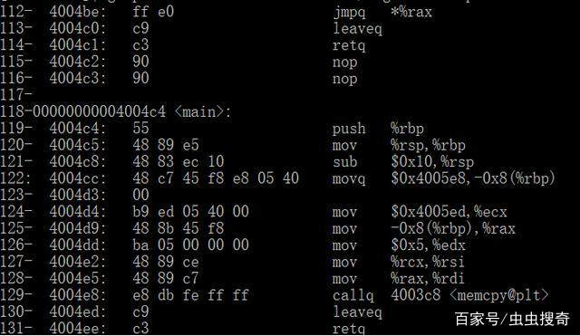

https://blog.csdn.net/qq_42519524/article/details/119608102

https://blog.csdn.net/ds1130071727/article/details/88525301

https://blog.csdn.net/zhengnianli/article/details/125551006

https://blog.csdn.net/USBdrivers/article/details/38570057/

https://blog.csdn.net/jinchi_boke/article/details/119427098

https://blog.csdn.net/xiaopengX6/article/details/128999678

https://blog.csdn.net/Horizonhui/article/details/79006439

https://blog.csdn.net/qq_42519524/article/details/119608102

https://blog.csdn.net/ds1130071727/article/details/88525301

https://blog.csdn.net/jeason29/article/details/49795631

https://blog.csdn.net/zhengnianli/article/details/125551006

https://blog.csdn.net/big_bear_xiong/article/details/126078999

https://blog.csdn.net/liwei3686755/article/details/53520861

在Linux上利用core dump和GDB调试segfault

播报文章

日常码农生活中，尤其是C/C++码农，时常会遇到段错误（segfault），调试非常费劲，除了单元测试和基本测试外，有些时候是在在线环境下，没有基本开发和测试工具，这就需要调试的技能。以前虫虫文章中介绍过使用strace进行系统调试和追踪《linux动态追踪神器&mdash;&mdash;Strace实例介绍》。今天虫虫再给大家介绍下利用core dump文件和gdb做应用程序调试和追踪的方法。

**段错误（segfault）**

"段错误"是程序试图操作不允许访问或试图访问的不允许内存的情况。可能导致段错误的原因主要有：

1、试图解引用空指针（你不允许访问内存地址0）

2、试图解引用不在你内存中的其他指针

3、一个C++ vtable虚表指针被破坏并指向错误的地方，这导致程序试图去执行一些不可执行的内存。

4、其他情况，比如未对齐的内存访问也可能会出现段错误。

**core dump 文件**

在linux下当应用程序发生异常中止退出或者发生崩溃的时候，linux内核会将应用程序在这段运行期间的内存状态等相关信息转存到磁盘，以供系统故障排查或者调试。这个转存的文件叫core dump文件。core dump文件中会记录程序当时的内存调用、堆栈引用、进程和线程调用等信息，可以帮助开发人员和维护人员了解异常发生当时的环境参数和信息，所以core dump对故障排查和bug调试具有重大的意义。

**通过valgrind调试段错误**

调试段错误最简单的方法是使用valgrind：其运行方法：

valgrind -v app

他的一个实例输出如下图：

它会提供的关于应用的堆栈跟踪。但是valgrind给出的东西有限，要深入探究还得利用得core dump文件，下面我们就对其进一步探究：

**如何获得core dump**

我们前面说了core dump是程序发生异常时候，其内存使用副本的转存文件，当你需要调试程具体序出错时的信息时候，它非常有用。

当程序发生段错误时，Linux内核有时会向磁盘写入一个core dump文件。很多人可能疑惑按照教程一步一步来做了，但是最后没有获得所需的core dump。一般情况下系统设置不输出core dump，所以没有生成core dump文件。

如果没有生成core dump文件，请按照以下步骤做设置：

1.在linux终端执行以下命令 ulimit -c unlimited

2.运行sysctl -w kernel.core_pattern=/tmp/core-%e.%p.%h.%t

**ulimit：**

在linux下 通过ulimit -c设置core dump的最大值。它默认设置为0，这时候内核就不会生成core dump。它以KB为单位。 ulimit是按进程为单位进行设置的。我们可以通过运行cat /proc/PID/limit来查看具体某个进程的大小限制。

例如，这些是我的系统随便一个nginx进程的大小限制：

cat /proc/8854/limits (PID换成你系统中具体的进程号，此处我的系统中进程号位8854)

内核通过soft limit值决定写入core文件的大小 （例如上图中我们的nginx"max core file size = 0"）。我们使用使用ulimit -c unlimited将软限制无限制，core dump文件就可以无限增大。我们也可以用具体文件大小来替代umlimited的值。

**kernel.core_pattern**

kernel.core_pattern是内核参数，通过 sysctl命令来配置，用于控制Linux内核将core dump写入磁盘的位置和文件名格式。

我们可以通过运行sysctl -a来获取当前系统的所有内核参数和设置值得列表。或者使用sysctl kernel.core_pattern仅查看kernel.core_pattern的设置值。

sysctl -w kernel.core_pattern=/tmp/core-%e.%p.%h.%t设置下core dump文件将被写入/tmp/core-（标识进程的参数值）。具体关于%e.%p.%h参数的表示内容，请参阅man core。

**Ubuntu下kernel.core_pattern设置**

默认情况下，Ubuntu上， kernel.core_pattern设置的内容为：

sysctl kernel.core_pattern

kernel.core_pattern = |/usr/share/apport/apport %p %s %c %d %P

这曾让我很困惑，这是什么东西，它是怎么处理我的core dump的。所以我搜索相关资料了解到：

Ubuntu使用称为"apport"的系统来记录apt包管理器中的崩溃

设置kernel.core_pattern = |/usr/share/apport/apport %p %s %c %d %P

表示core dump内容被重定向到apport，其日志为/var/log/apport.log

默认情况下，apport将忽略来非Ubuntu软件包的二进制文件的那部分的崩溃日志。所以默认apport.log中默认也是不会记录core dump信息的。为了得到core dump具体做法就是重新设置kernel.core_pattern的值，将其设为sysctl -w kernel.core_pattern=/tmp/core-%e.%p.%h.%t。

**用gdb进行追踪**

core dump中信息是支持用gdb做调试的，关于gdb是linux下一个强大的debug调试程序，不熟悉的同学，先搜索一下。

用下面的gdb命令打开一个core dump文件：

gdb -c my_core_file

接下来，我们想知道程序崩溃时的堆栈是什么。在gdb提示符下运行bt会给你一个堆栈追踪。默认情况下，编译时候没有做符号调试，gdb无法加载二进制符号，所以追踪结果中会都是??。如下图所示：

这种情况下，我们需要加载符号符号表，使得显示正常。可通过在gdb命令下执行：

symbol-file 应用的执行程序（绝对路径）

sharedlibrary

这会从二进制程序文件及其引入的共享库中加载符号。执行后，再次输入bt，gdb就会返回带有行号堆栈跟踪信息。

如果你想让其工作正常，在做程序做调试时候应该启用哦调试符号编译（gcc -g）。在试图找出程序崩溃的原因时，在堆栈跟踪中有行号非常有用。

在gdb也可以查看每个线程的堆栈，具体方法如下： thread apply all bt full

**调试段错误的其他方法**

**ASAN方法**

调试段错误的其他方法还有ddressSanitizer（"ASAN"）（$ CC -fsanitize = address）编译程序并运行它。

**dmesg方法**

**ldd方法：**

**nm 方法：**

**objdump方法（结合demsg获取地址）**

**catchsegv方法**

限于篇幅本文章中对他们不做叙述，如果同学们对此感兴趣，请给虫虫留言，有机会以后会撰写专门文章介绍。

**总结**

从core dump获取堆栈跟踪相当简单和易用。最后我们总结下发生段错误的程序进行堆栈跟踪步骤基本如下：

首先考虑使用valgrind

如果这不起作用，或者你想要core dump进行调试：

1确保二进制文件是用调试符号编译的

2.正确设置ulimit和kernel.core_pattern

3.运行程序

4.用gdb打开你的core dump，加载符号，然后运行bt

5.试图弄清楚发生了什么！